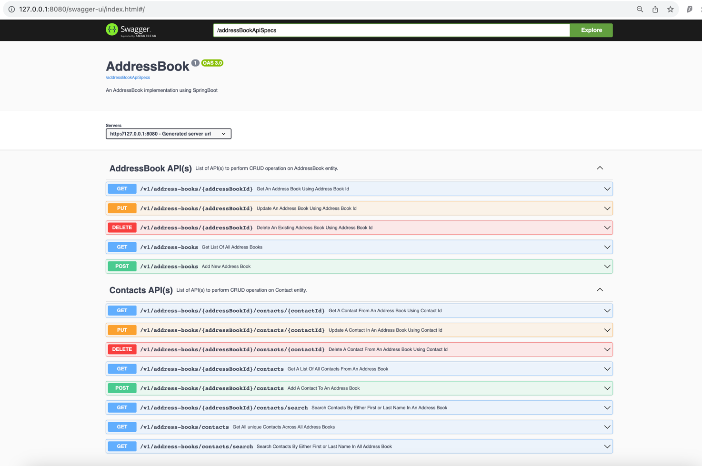
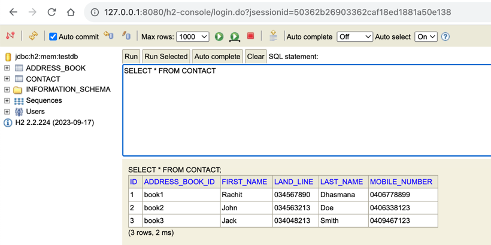
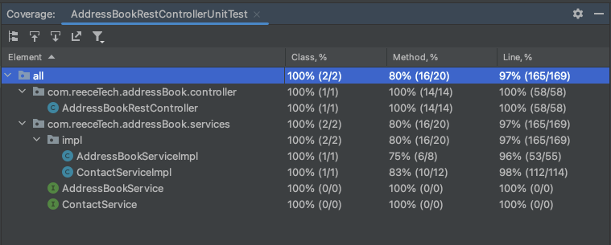

# AddressBook
## _An AddressBook Implementation using Spring Boot_

AddressBook is a Java based implementation of a web application api framework that provides REST api(s) to 
perform basic operations on an addressBook. 

## Features

- Add multiple address books to maintain contacts.
- Delete an address book.
- Update the name or description of an address book.
- Add contacts to any address book.
- Update a contact in an address book.
- Delete a contact from an address book.
- Fetch a contact from an address book.
- Fetch all unique contacts across address book.
- search a contact by first name or last name in an address book or across all address books.

## Tech

AddressBook utilises following tech internally:

- [Java](https://openjdk.org/projects/jdk/21/) - OpenJDK, version 21
- [SpringBoot](https://spring.io/projects/spring-boot) - SpringBoot framework for web api(s), version 3.14
- [H2](https://www.h2database.com/html/main.html) - H2 as an in-memory DB to store volatile records.
- [Spring Data JPA](https://docs.spring.io/spring-data/jpa/docs/current/reference/html/) - JPA repository for CRUD implementation. 
- [OpenApi](https://www.openapis.org/) - OpenAPI standards to generate API specs using swagger 3.X
- [Docker](https://www.docker.com/) - Dockerising the solution and publishing the image.
- [Maven](https://maven.apache.org/) - Building the application jar, version 3.9.6.
- [Spotless](https://github.com/diffplug/spotless/tree/main/plugin-maven) - Maven plugin to validate and auto-fix the java checkstyle (Google) issues.


## Building and Running the code
AddressBook requires following dependencies to run manually.
 - [OpenJDK](https://openjdk.org/projects/jdk/21/) v21
 - [Maven](https://maven.apache.org/) v3.9.6
 - [SpringBoot](https://github.com/diffplug/spotless/tree/main/plugin-maven) v 3.1.4

Install the dependencies and devDependencies and start the server.

### Cloning the code
```
git clone https://github.com/rachitdhasmana/addressBook.git
```

### Once Cloned, got to the root folder and run maven build.
```
cd addressBook
mvn install
```
This should generate a jar file in addressBook/target location. 

### Run the jar file. 
```
java -jar target/addressBook-0.0.1.jar
```

The above command should start a server that shall be listening on port 8080.

### Access the API spec at
```
http://127.0.0.1:8080/addressBookApiSpecs
```
### Access SwaggerUI API specs and details at 
```
http://127.0.0.1:8080/swagger-ui/index.html
```
### Access H2 DB UI at
```
http://127.0.0.1:8080/h2-console
Driver Class: org.h2.Driver
JDBC URL: jdbc:h2:mem:testdb
User Name: sa
PAssword: passw0rded!
```

## Running the code using hosted docker image
A docker image for the addressBook implementation has been uploaded to dockerhub

### Image URL
```
https://hub.docker.com/repository/docker/rachitdhasmana/address-book/general
```
### Pulling and Running the image
```
docker pull rachitdhasmana/address-book:latest
docker run -d -p 8080:8080 rachitdhasmana/address-book
```

## Building and running local docker image
A local docker image for the implementation can be build by running the docker file.
```
docker build -t address-book .
docker run -d -p 8080:8080 address-book
```

# Screenshots related to the application
### Swagger UI


### H2 DB UI


### Unit test code Coverage
